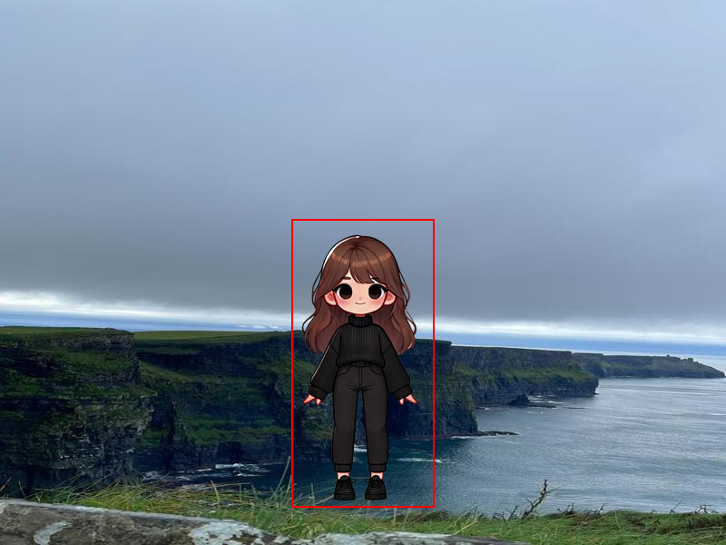

# Controle de Robô via UDP e Pygame

Sistema cliente-servidor em UDP onde um controlador de linha de comando envia, em tempo real, comandos de movimento para um robô renderizado com Pygame. Projeto desenvolvido na graduação, na disciplina de **Serviços de Rede**, para exercitar protocolos, concorrência e arquitetura de game loop em Python.

## Visão Geral
- **Servidor (robot.py):** loop de jogo Pygame + socket UDP não bloqueante ouvindo na porta 2024; aplica o último comando recebido ao sprite do robô.
- **Cliente (cliente_robot.py):** CLI simples que envia comandos `up/down/left/right` para o servidor na porta 2024, usando a porta local 2025.
- **Protocolo textual:** mensagens no formato `controle;<acao>` mantêm o tráfego leve e fácil de debugar.
- **Concorrência:** thread dedicada à recepção de pacotes protege o loop gráfico; `threading.Lock` garante que o comando lido seja consistente.

## Aprendizados Destacados
- Diferenças práticas entre **UDP e TCP** para controle em tempo real (tolerância a perda vs. latência baixa).
- Uso de **sockets não bloqueantes** para impedir que I/O congele o renderizador.
- Coordenação de **threads** com `Lock` para compartilhar estado de forma segura entre rede e jogo.
- **Game loop** a 60 FPS no Pygame, desacoplado da entrada de comandos.
- Criação de um **protocolo mínimo** (`controle;<acao>`) fácil de estender com novos verbos.
- Separação clara entre **cliente de controle** e **servidor visual**, favorecendo testes e substituição futura do frontend.

## Arquitetura em alto nível
```
[CLI cliente] --UDP/2025->2024--> [Thread de rede] --Lock--> [Loop Pygame]
      ↑                                                    ↓
      |------------------ feedback visual na tela --------|
```

## Prévia Visual


## Estrutura de Arquivos
- `robot.py`: servidor UDP + renderização Pygame; aplica comandos ao sprite.
- `cliente_robot.py`: CLI para enviar comandos de movimento ao servidor.
- `background2.jpeg` / `background.jpg`: cenários customizados inspirados na cidade onde já morei, para dar identidade pessoal ao projeto.
- `manujogo.png` / `robot.png`: sprites; substituí o boneco sugerido em aula por um personagem que reflete mais pertencimento.

## Requisitos
- Python 3.10+ (testado localmente).
- Pygame instalado: `pip install pygame`.

## Como Executar
1) Inicie o servidor gráfico:
```bash
python robot.py
```
2) Em outro terminal, execute o cliente controlador:
```bash
python cliente_robot.py
```
3) Use os comandos na CLI: `up`, `down`, `left`, `right` (ou `q` para sair).

## Funcionamento do Loop
- A thread de rede atualiza `current_command` quando recebe um pacote UDP.
- O loop principal lê o último comando disponível a cada frame e move o sprite.
- Com `sock.setblocking(0)`, o jogo continua fluido mesmo sem receber pacotes.

## Possíveis Extensões
- Confiabilidade opcional (reenvio/ACK) ou uso de TCP para comparar latência vs. entrega garantida.
- Novos comandos (`jump`, rotação, velocidade variável) seguindo o mesmo protocolo textual.
- HUD com status de rede (perda de pacotes, RTT estimado) e limites de área.
- Gravação de sessões para análise de tráfego em laboratório de redes.

